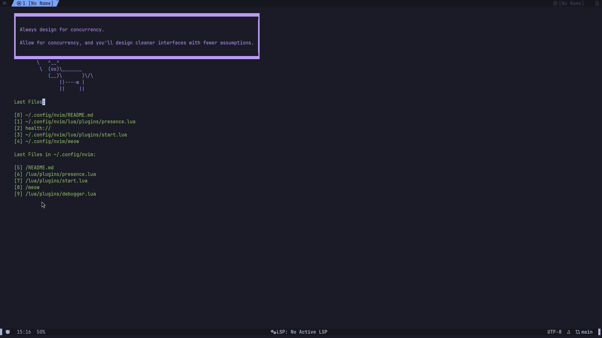

# neovim configuration files

# Requirements:
- Neovim 0.10.x or higher
- Python 3.12.x or higher
- NodeJS, LTS or Latest is recommended
- cmake
- Ninja
- Meson
- tar, unzip
- git
- Luarocks for formatters regarding Lua
- ripgrep
- fd
- fzf

# Core Plugins

- folke/tokyonight.nvim - Colorscheme
- folke/noice.nvim - UI enhancement
- MunifTanjim/nui.nvim - UI component library
- rcarriga/nvim-notify - Notification manager
- folke/which-key.nvim - Keybinding helper
- folke/lazydev.nvim - Development helper for Lua

# LSP & Completion

- williamboman/mason.nvim - Package manager for LSP, DAP, linters
- williamboman/mason-lspconfig.nvim - Mason integration with lspconfig
- WhoIsSethDaniel/mason-tool-installer.nvim - Automated tool installer for Mason
- neovim/nvim-lspconfig - Configuration for Neovim's built-in LSP
- saghen/blink.cmp - Completion plugin
- L3MON4D3/LuaSnip - Snippet engine
- rafamadriz/friendly-snippets - Collection of snippets

# UI Components

- nanozuki/tabby.nvim - Tab bar
- nvim-tree/nvim-web-devicons - Icons for UI components
- Bekaboo/dropbar.nvim - Breadcrumb navigation
- nvim-telescope/telescope-fzf-native.nvim - Fuzzy finder native extension

# Language Support

- mrcjkb/rustaceanvim - Rust support
- nvim-treesitter/nvim-treesitter - Syntax highlighting and code navigation

# Debugging & Development

- mfussenegger/nvim-dap - Debug adapter protocol
- jay-babu/mason-nvim-dap.nvim - DAP integration with Mason
- folke/trouble.nvim - Pretty diagnostics viewer

# Formatting & Linting

- mfussenegger/nvim-lint - Linting
- stevearc/conform.nvim - Formatting

# Integrations

- github/copilot.vim - GitHub Copilot integration
- andweeb/presence.nvim - Discord Rich Presence integration
